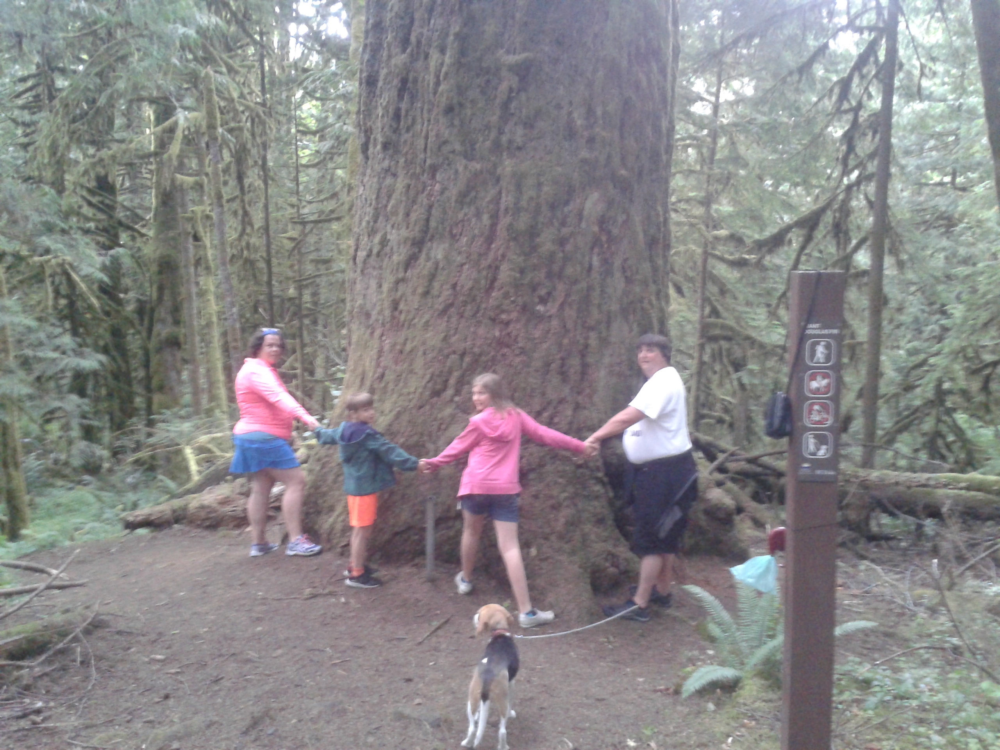

On a ete a Cultus Lake, voir le plus gros Sequoias dans la region. C'etais un arbre de 2000 ans. Il a fallut marche dans la foret tres humide et revenir a la pluie. Tous le temps il y avait une facon de venir tous pres de l'arbre en auto qu'on avait pas trouve.
On a couche a Chilliwack dans un hotel. 

